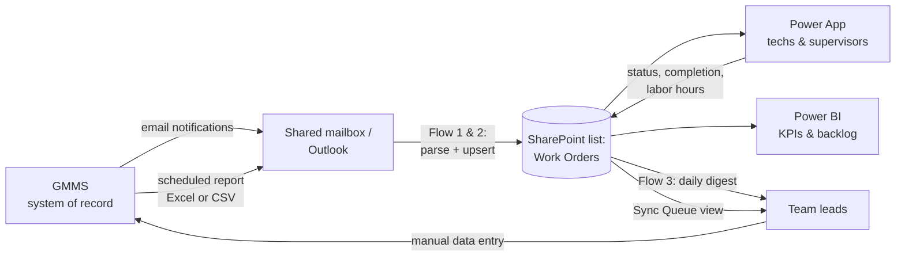

# Work Orders — GMMS Companion System

A work order scheduling, tracking, and completion system for technicians and supervisors,
built entirely on **standard Microsoft 365 / Power Platform components** so it runs on a
restricted network (OpenNet) with **no premium connectors, no custom connectors, and no
external APIs**.

GMMS remains the **system of record**. This system is the **system of engagement** — the
thing people actually look at and touch every day. Data flows *out* of GMMS automatically
(email notifications and/or scheduled report exports) and flows *back into* GMMS through a
deliberate, tracked human step (the Sync Queue).

## The core design rules

1. **One source of truth for the team layer:** a SharePoint list called `Work Orders`.
   Not Planner, not Excel, not the Power App itself. Planner and Power BI are *views* of
   the list. This is what makes reporting, auditing, and reconciliation possible.
2. **Standard connectors only:** SharePoint, Office 365 Outlook, Office 365 Users,
   Excel Online (Business), Teams (optional), Planner (optional), Content Conversion.
   Nothing premium, nothing custom.
3. **Structured ingest beats OCR.** Order of preference:
   1. A **scheduled GMMS report export** (Excel/CSV) delivered by email or dropped in a
      SharePoint library — parsed automatically. Most reliable, also enables reconciliation.
   2. **GMMS email notifications** parsed with Power Automate expressions.
   3. OCR of PDFs — **last resort only**. AI Builder is premium/limited in government
      clouds and OCR of report PDFs is fragile. Avoid if either option above exists.
4. **Write-back is a first-class workflow, not an afterthought.** Every change that must
   reach GMMS flags the item `GMMS Sync = Pending`. Team leads work the Sync Queue on a
   battle rhythm, and a reconciliation pass catches anything that drifts.

## Architecture

## Repository map

| Path | What it is |
|---|---|
| `docs/01-architecture.md` | Full design: decisions, data flow, failure modes |
| `docs/02-data-dictionary.md` | Every list, every column, every choice value |
| `docs/03-build-sharepoint.md` | Click-by-click SharePoint setup |
| `docs/04-build-flows.md` | Each Power Automate flow, step by step, with the exact expressions |
| `docs/05-build-power-app.md` | Canvas app build guide with all Power Fx formulas |
| `docs/06-power-bi.md` | Data connection + DAX measures + report layout |
| `docs/07-gmms-writeback-sop.md` | The human sync loop — SOP for team leads |
| `sharepoint/` | Machine-readable list schemas |
| `power-apps/src/` | Power Fx YAML source for the app screens |
| `samples/` | Sample GMMS notification email and report export for testing parsers |

## Build order

1. **SharePoint** (`docs/03`) — create the `Work Orders` and `Team Roster` lists. ~1 hour.
2. **Capture real GMMS output** — forward 2–3 real notification emails and (if possible)
   set up a daily scheduled report export from GMMS. The flow parsers key off the exact
   text, so the samples in `samples/` must be replaced with your real formats.
3. **Flows** (`docs/04`) — intake flow(s) first, prove the upsert works, then the digest.
4. **Power App** (`docs/05`) — build screens against the now-populated list.
5. **Power BI** (`docs/06`) — last; it's read-only over the list.
6. **SOP** (`docs/07`) — brief the team leads, pick the sync battle rhythm, go live.

## What this system does *not* do

- It does not write to GMMS. Nothing on OpenNet can. The Sync Queue + SOP is the
  compensating control, and the reconciliation flow tells you when the two systems drift.
- It does not replace GMMS for compliance/official reporting. GMMS stays authoritative.
